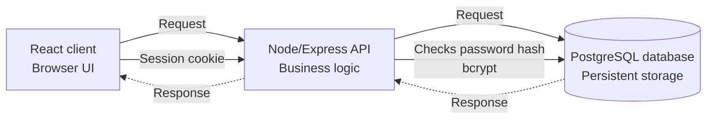

```mermaid
flowchart LR
    Client["React client<br/>Browser UI"] -->|Request| API["Node/Express API<br/>Business logic"]
    API -.->|Response| Client

    API -->|Request| DB[("PostgreSQL database<br/>Persistent storage")]
    DB -.->|Response| API

    Client -->|Session cookie| API
    API -->|Checks password hash<br/>bcrypt| DB
```

---

